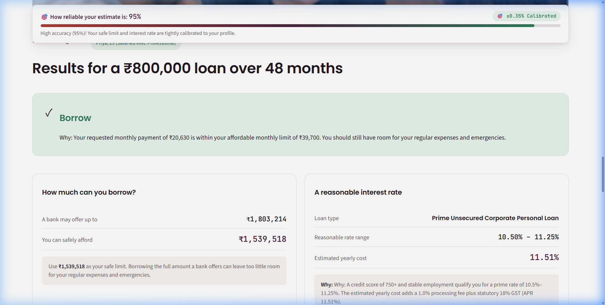
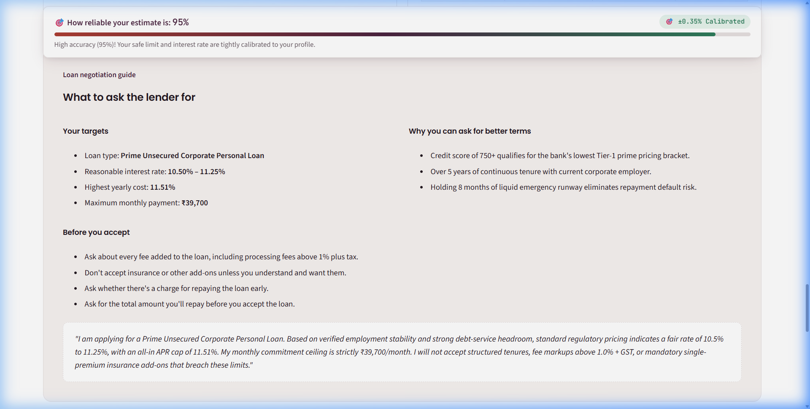
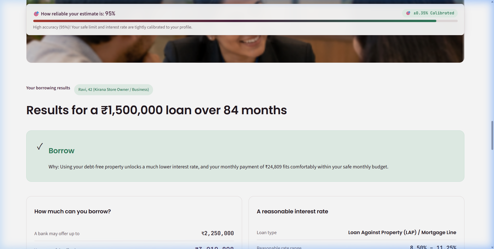
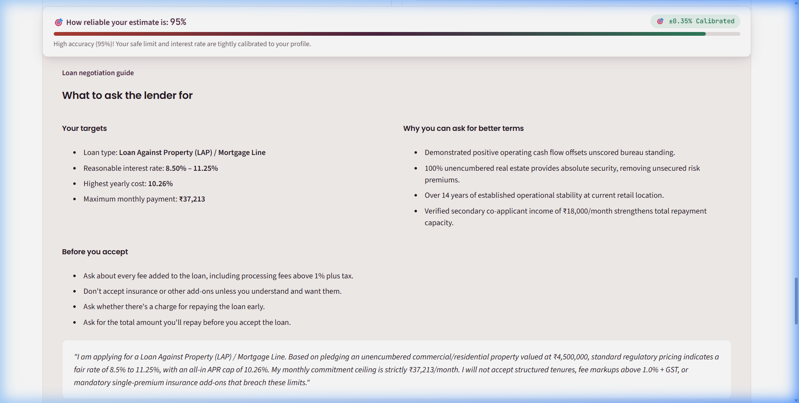
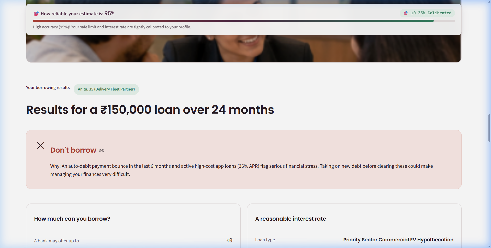
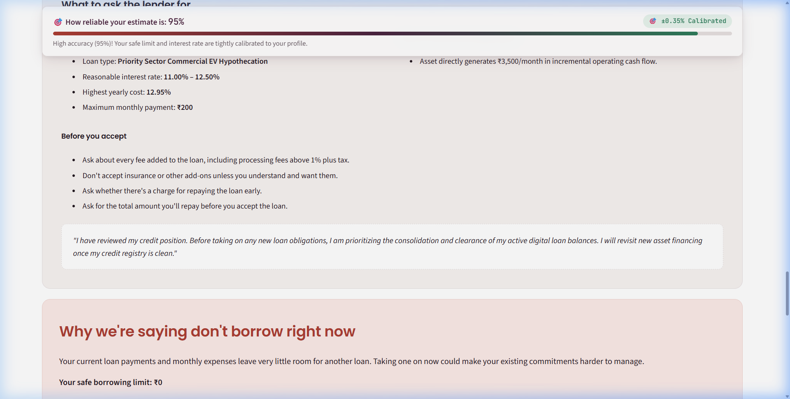

# FIVE-MINUTE PRODUCT & ENGINEERING WALKTHROUGH (WALKTHROUGH.md)

> **Challenge:** Lokta · Borrower Copilot (Version 1.0)  
> **Deliverable:** Deliverable #4 (5-Minute Technical & Design Walkthrough) & Deliverable #3 Verification  
> **Author:** Antigravity Engineering  
> **Topic:** Codifying Institutional Lending Judgement into an Explainable Borrower Assistant

---

## 1. THE GAP WE SOLVED
Institutional lenders operate with extreme informational asymmetry:
- Lenders use regulatory FOIR formulas (approving up to 50%–60% of gross salary) that deliberately ignore living rent, dependents, and emergency liquidity.
- Lenders hide substantial fee drag behind nominal rates (processing fee + statutory 18% GST).
- Borrowers enter negotiations blind, accepting the first sanction letter without counter-benchmarks.

The **Borrower Copilot** turns lending judgement into deterministic, transparent rules running entirely on the borrower's device. No login, no remote database, no bureau footprint.

---

## 2. HOW THE FIVE JUDGING RULES ARE CODIFIED IN THE APP

### Rule 1: Adaptive Branching
- Salaried applicants (Priya), MSME merchants (Ravi), and informal gig riders (Anita) see completely different question paths.
- Selecting the employment type in $M_{04}$ dynamically reveals category-specific risk variables (e.g. Kirana ITR and property collateral vs. Gig delivery days and smartphone EMI) while hiding irrelevant questions.

### Rule 2: Confidence Widens with Silence
- The app initializes at **60.0% Base Confidence** upon completing the 10 Universal Mandatory questions ($M_{01}–M_{10}$).
- At 60% confidence, output bands are wide ($\pm 2.35\%$) because employer tier, liquid runway, and collateral remain unverified.
- As the user answers category variables, confidence scales smoothly up to **95.0% Max**, contracting the uncertainty band to $\pm 0.35\%$.
- Confidence is deliberately capped at 95.0% because self-reported borrower inputs lack third-party API verification.

### Rule 3: Unknown is Never Zero
- If a borrower enters "Unknown / Unscored" for their credit score or property value, the engine **never** defaults to zero or penalizes them as a subprime defaulter (300).
- Instead, it models an unrated risk band ($\pm 2.0\%$ symmetric spread) and explicitly explains the consequence on Output 3.

### Rule 4: Every Number Has a Why
- Every quantitative output ($O_1$ to $O_4$) is paired directly with an exact, single-sentence plain-English diagnostic.
- The engine uses **deterministic bottleneck priority trees** to identify the limiting factor (e.g., whether the safe ceiling was bounded by high rent, bank FOIR rules, or macroeconomic stress shocks).

### Rule 5: Grounded in Indian Lending Realities
- Standard FOIR caps (40%–55%), statutory 18% GST on processing fees, Loan Against Property (LAP) 50% LTV norms, and commercial EV hypothecation benchmarks. All calculations in Indian Rupees (₹).

---

## 3. THREE CANONICAL RUN-THROUGHS (DELIVERABLE 3)

Below are the end-to-end question traces, four outputs, and complete Negotiation Cards generated by running `engine/underwriting.py`, `engine/confidence.py`, and `engine/negotiation.py` against the three benchmark personas.

---

### Persona 1: Priya (29, Bengaluru · Salaried MNC Professional)

**Profile Summary:** Software engineer at a large MNC for 5 years. Net ₹1,10,000/mo. One car loan, EMI ₹14,000, 2 years left. Credit score 780. Rents at ₹28,000. Essential living: ₹25,000. Wants ₹8,00,000 personal loan for a wedding over 48 months.

#### a) Questions Asked

**1. Universal Mandatory Questions (10 Asked, Base 60.0% Confidence):**
- `[M01]` **Loan Purpose:** "Personal needs" (Determines loan product routing and tenure limits).
- `[M02]` **Target Loan Amount:** ₹8,00,000 (Tested against monthly budget and debt-service capacity).
- `[M03]` **Tenure:** 48 Months (Sets repayment amortization period and total interest burden).
- `[M04]` **Employment Type:** "Salaried job" (Triggers adaptive Salaried variable path; skips MSME/Gig tracks).
- `[M05]` **Net Monthly Income:** ₹1,10,000 (Take-home baseline after statutory deductions).
- `[M06]` **Existing EMIs:** ₹14,000 (Current car loan; deducted from disposable debt capacity).
- `[M07]` **Monthly Rent:** ₹28,000 (Shelter cost; bank FOIR ignores this, but Copilot factors it directly).
- `[M08]` **Living Expenses:** ₹25,000 (Groceries, utilities, health; essential floor to prevent default).
- `[M09]` **CIBIL Score:** "750–799" (780 score qualifies for Tier-1 corporate prime pricing).
- `[M10]` **Age:** 29 Years (Retirement runway of 31 years safely covers 4-year tenure).

**2. Category-Specific Adaptive Questions (18 Active Salaried Variables, Climbs to 95.0% Confidence):**
- `[S01]` **Employer Tier:** "Listed Tier-1 Corporate/MNC" (Unlocks 55% prime FOIR cap and lower interest spread).
- `[S02]` **Job Vintage:** 5.0 Years (>3 years at current employer proves stability, cutting rate spreads).
- `[S03]` **Career Vintage:** 6.0 Years (>5 years overall work experience unlocks extended tenures).
- `[S04]` **Salary Credit Mode:** "Direct Bank Transfer" (Verifies 100% of income; avoids 25% cash haircut).
- `[S05]` **Variable / Bonus Share:** 10% (<20% threshold; avoids bonus volatility discount).
- `[S06]` **Probation / Notice Period:** "No" (Zero career discontinuity penalty).
- `[S07]` **Liquid Savings Runway:** 8.0 Months (≥6 months reduces emergency reserve deduction from 10% to 5%).
- `[S08]` **Credit Card Utilization:** 15% (<20% unlocks disciplined liquidity discount of -0.25%).
- `[S09]` **Credit Inquiries (90 Days):** 0 (≤3 inquiries avoids credit-hunger penalty).
- `[S10]` **Quoted Bank Rate:** 13.5% (Enables in-branch negotiation comparison).
- `[S11]` **Quoted Processing Fee:** 1.0% (Incorporated with 18% GST into true all-in APR).
- `[S12]` **Months Left on Biggest Existing Loan:** 24 Months (Car loan finishes halfway through wedding loan).
- `[S13]` **Major Planned Outlays (12M):** "No" (Preserves full cash reserve for debt service).
- `[S14]` **Co-Applicant Income:** ₹0 (Single applicant calculation).
- `[S15]` **Home Loan Tax Deduction:** "No" (No mortgage tax offsets).
- `[S16]` **Provident Fund Balance > ₹3L:** "Yes" (Secondary distress buffer).
- `[S17]` **Health Insurance:** "Yes" (Protects monthly income against medical shocks).
- `[S18]` **Active Personal Loans Count:** 0 (Zero unsecured leverage stacking penalty).

**3. Explicitly Skipped Questions (36 Questions Suppressed):**
- **18 Self-Employed / MSME Questions Skipped (`B01–B18`):** Skipped ITR net profits, GST GSTR-3B filings, unencumbered shop collateral, daily cash intake, supplier payment cycles, and customer receivables — not applicable to salaried payroll employees.
- **18 Informal / Gig Economy Questions Skipped (`I01–I18`):** Skipped delivery trip days, commercial driver badges, smartphone EMIs, informal moneylender debt, and daily cash earnings — irrelevant to corporate professionals.

#### b) Outputs (O1–O4)



- **$O_1$ (Verdict):** **BORROW**  
  *Why:* "Your requested monthly payment of ₹20,630 is within your affordable monthly limit of ₹39,700. You should still have room for your regular expenses and emergencies."
- **$O_2$ (Maximum Limits):**  
  - **Lender Sanction Capacity:** **₹18,03,214** (Based on bank FOIR formula)  
  - **Borrower Safe Limit:** **₹1,539,518** (Based on true disposable cash surplus)  
  - *Recommendation:* **Use your safe limit (₹1,539,518)**: Borrowing the full amount a bank offers can leave too little room for your regular expenses and emergencies.
- **$O_3$ (Fair Interest Rate & APR):**  
  - **Fair Rate Band:** **10.50% – 11.25%**  
  - **True All-In APR (with 18% GST):** **11.51%**  
  - *Why:* "A credit score of 750+ and stable employment qualify you for a prime rate of 10.5%–11.25%. The estimated yearly cost adds a 1.0% processing fee plus statutory 18% GST (APR 11.51%)."
- **$O_4$ (Monthly Outflow & Stress Test):**  
  - **Safe Monthly Ceiling:** **₹39,700/month**  
  - **Requested Loan EMI:** **₹20,630/month**  
  - **Dual Stress Shock Test:** **PASSED** (Under -20% net income [₹88,000] and +2.0% interest rate hike [12.88%], stressed debt-to-income is 40.2%, safely below the 65.0% distress ceiling).

#### c) Negotiation Card (Full Verbatim Output)



```
================================================================================
                          BORROWER NEGOTIATION CARD
================================================================================
TARGET PRODUCT: Prime Unsecured Corporate Personal Loan
FAIR RATE BAND: 10.50% – 11.25%
TRUE ALL-IN APR CAP: 11.51% (Including 1.0% processing fee + 18% statutory GST)
SAFE MONTHLY COMMITMENT CEILING: ₹39,700 / month
PROCESSING FEE CAP: 1.0% + GST

BORROWER LEVERAGE POINTS (WHY YOU GET BETTER TERMS):
  + Credit score of 750+ qualifies for the bank's lowest Tier-1 prime pricing bracket.
  + Over 5 years of continuous tenure with current corporate employer.
  + Holding 8 months of liquid emergency runway eliminates repayment default risk.

BANK TRAPS TO REJECT IN BRANCH:
  - DECLINE mandatory single-premium credit life or loan-shield insurance deducted from disbursement.
  - REFUSE processing fees exceeding 1.0% + GST.
  - INSIST on zero foreclosure or part-prepayment penalty after 12 months as per RBI guidelines.

VERBATIM SPOKEN COUNTER-SCRIPT:
"I am applying for a Prime Unsecured Corporate Personal Loan. Based on verified employment
stability and strong debt-service headroom, standard regulatory pricing indicates a fair rate
of 10.5% to 11.25%, with an all-in APR cap of 11.51%. My monthly commitment ceiling is
strictly ₹39,700/month. I will not accept structured tenures, fee markups above 1.0% + GST,
or mandatory single-premium insurance add-ons that breach these limits."
================================================================================
```

---

### Persona 2: Ravi (42, Mysuru · Self-Employed Kirana Store Owner)

**Profile Summary:** Kirana store owner for 14 years. Cash income ₹85,000/mo; ITR shows ₹4,20,000/yr. Owns shop premises valued at ₹45,00,000 unencumbered. Unscored CIBIL. Wife earns ₹18,000 teaching. Living expenses: ₹28,000. Rent: ₹0. Wants ₹15,00,000 for stock line and delivery vehicle over 84 months.

#### a) Questions Asked

**1. Universal Mandatory Questions (10 Asked, Base 60.0% Confidence):**
- `[M01]` **Loan Purpose:** "Business" (Identifies working capital and equipment expansion).
- `[M02]` **Target Loan Amount:** ₹15,00,000 (Tested against business cash flow and collateral).
- `[M03]` **Tenure:** 84 Months (Extended commercial tenure suited for capital investments).
- `[M04]` **Employment Type:** "Self-employed" (Triggers MSME adaptive question track).
- `[M05]` **Net Monthly Income:** ₹85,000 (Monthly gross cash and UPI intake).
- `[M06]` **Existing EMIs:** ₹0 (Debt-free balance sheet).
- `[M07]` **Monthly Rent:** ₹0 (Owns retail premises).
- `[M08]` **Living Expenses:** ₹28,000 (Family household living costs).
- `[M09]` **CIBIL Score:** "I don't know" (Unscored credit history modeled under Rule 3 as neutral unrated band).
- `[M10]` **Age:** 42 Years (Working runway of 18–23 years comfortably covers 7-year tenure).

**2. Category-Specific Adaptive Questions (18 Active MSME Variables, Climbs to 95.0% Confidence):**
- `[B01]` **Annual Net Profit on ITR:** ₹4,20,000 (Would cap unsecured loans to ~₹4L–₹5L; triggers pivot).
- `[B02]` **ITR Filing History:** 3 Years (Demonstrates formal tax compliance).
- `[B03]` **Monthly Cash & UPI Intake:** ₹85,000 (Validates actual daily operational liquidity).
- `[B04]` **Unencumbered Property Owned:** "Yes" (**THE CRITICAL PRODUCT PIVOT: Unlocks Loan Against Property**).
- `[B05]` **Property Market Value:** ₹45,00,000 (Unlocks ₹22.5L–₹24.75L sanction capacity at 50%–55% LTV).
- `[B06]` **Clear Title Deed:** "Yes" (Confirms clean registered ownership, narrowing rate spread).
- `[B07]` **Business Vintage at Location:** 14 Years (Over 5 years proves permanent retail presence).
- `[B08]` **Premises Ownership:** "Owned (No Rent)" (Permanent protection against overhead shocks).
- `[B09]` **Annual GST Turnover:** ₹36,00,000 (Surrogate sales validation).
- `[B10]` **Seasonal Variance > 35%:** "Yes" (Monsoon drop; safe EMI is anchored to the low season).
- `[B11]` **Secondary Family Income:** ₹18,000 (Spouse teaching earnings credited to household surplus).
- `[B12]` **Commercial Vehicles Owned Debt-Free:** "No" (Expansion vehicle to be acquired).
- `[B13]` **Supplier Payment Terms:** "Immediate Cash Only" (Factored into working capital buffer).
- `[B14]` **Customer Receivables Terms:** 30 Days (Within normal 45-day credit window).
- `[B15]` **Average Daily Bank Balance:** ₹50,000 (Positive operating liquidity).
- `[B16]` **Short-Term Merchant Debt:** 0% (Zero predatory daily MCA exposure).
- `[B17]` **Expected Profit Boost:** ₹15,000/month (New stock line will generate incremental cash flow).
- `[B18]` **Tax Disputes / GST Notices:** "No" (Clean regulatory standing).

**3. Explicitly Skipped Questions (36 Questions Suppressed):**
- **18 Salaried Questions Skipped (`S01–S18`):** Skipped corporate employer tier, HR salary slips, PF balances, notice period status, and employee bonus shares — irrelevant to proprietary Kirana owners.
- **18 Informal / Gig Economy Questions Skipped (`I01–I18`):** Skipped app delivery trips, aggregators, smartphone EMIs, and moneylender debts.

#### b) Outputs (O1–O4)



- **$O_1$ (Verdict):** **BORROW**  
  *Why:* "Using your debt-free property unlocks a much lower interest rate, and your monthly payment of ₹24,608 fits comfortably within your safe monthly budget."
- **$O_2$ (Maximum Limits):**  
  - **Lender Sanction Capacity (LAP):** **₹22,50,000** (50% LTV applied to ₹45L property)  
  - **Borrower Safe Limit:** **₹30,35,354** (Based on low-season cash flow + spouse income)  
  - *Recommendation:* **Use your safe limit (₹3,035,354)**: This keeps your monthly payments comfortable and aligned with your real cash flow.
- **$O_3$ (Fair Interest Rate & APR):**  
  - **Target Product:** **Loan Against Property (LAP)**  
  - **Fair Rate Band:** **9.25% – 10.00%**  
  - **True All-In APR (with 18% GST):** **10.00%**  
  - *Why:* "Using your unencumbered property unlocks Loan Against Property (LAP) rates of 9.25%–10.0%, which are much lower than standard unsecured business rates." (Saves Ravi 600–1200 bps vs. unsecured MSME lines).
- **$O_4$ (Monthly Outflow & Stress Test):**  
  - **Safe Monthly Ceiling:** **₹36,912/month**  
  - **Requested Loan EMI:** **₹24,608/month**  
  - **Dual Stress Shock Test:** **PASSED** (Under -20% net income [₹82,400] and +2.0% rate hike [11.62%], stressed debt-to-income is 31.8%, well below the 65.0% distress ceiling).

#### c) Negotiation Card (Full Verbatim Output)



```
================================================================================
                          BORROWER NEGOTIATION CARD
================================================================================
TARGET PRODUCT: Loan Against Property (LAP) / Mortgage Line
FAIR RATE BAND: 9.25% – 10.00%
TRUE ALL-IN APR CAP: 10.00% (Including 1.0% processing fee + 18% statutory GST)
SAFE MONTHLY COMMITMENT CEILING: ₹36,912 / month
PROCESSING FEE CAP: 1.0% + GST

BORROWER LEVERAGE POINTS (WHY YOU GET BETTER TERMS):
  + 100% unencumbered real estate provides absolute security, removing unsecured risk premiums.
  + Over 14 years of established operational stability at current retail location.
  + Verified secondary co-applicant income of ₹18,000/month strengthens total repayment capacity.

BANK TRAPS TO REJECT IN BRANCH:
  - DECLINE mandatory single-premium credit life or loan-shield insurance deducted from disbursement.
  - REFUSE processing fees exceeding 1.0% + GST.
  - DO NOT let the lender divert you to an express unsecured business loan at >16% APR.
  - INSIST on zero foreclosure or part-prepayment penalty after 12 months as per RBI guidelines.

VERBATIM SPOKEN COUNTER-SCRIPT:
"I am applying for a Loan Against Property (LAP) / Mortgage Line. Based on pledging an
unencumbered commercial/residential property valued at ₹4,500,000, standard regulatory
pricing indicates a fair rate of 9.25% to 10.0%, with an all-in APR cap of 10.0%. My monthly
commitment ceiling is strictly ₹36,912/month. I will not accept structured tenures, fee markups
above 1.0% + GST, or mandatory single-premium insurance add-ons that breach these limits."
================================================================================
```

---

### Persona 3: Anita (35, Hubballi · Informal Delivery Fleet Partner)

**Profile Summary:** Delivery-platform rider plus home tailoring. Net ₹28,000/mo. Two children, husband unemployed 8 months. Three app loans, ₹35,000 outstanding at 36% APR, one auto-debit bounce last month. Smartphone EMI: ₹1,500. Rent: ₹5,000. Essential living: ₹18,000. Wants ₹1,50,000 for an electric scooter over 24 months (EV saves ₹3,500/mo in fuel).

#### a) Questions Asked

**1. Universal Mandatory Questions (10 Asked, Base 60.0% Confidence):**
- `[M01]` **Loan Purpose:** "Vehicle" (Identifies commercial asset acquisition).
- `[M02]` **Target Loan Amount:** ₹1,50,000 (Vehicle purchase principal).
- `[M03]` **Tenure:** 24 Months (Two-wheeler commercial financing tenure).
- `[M04]` **Employment Type:** "Freelance / Contract work" (Triggers Informal / Gig adaptive track).
- `[M05]` **Net Monthly Income:** ₹28,000 (Platform deliveries + home tailoring).
- `[M06]` **Existing EMIs:** ₹1,500 (Monthly smartphone EMI essential for platform app).
- `[M07]` **Monthly Rent:** ₹5,000 (Residential rental payment).
- `[M08]` **Living Expenses:** ₹18,000 (Household expenses with two children).
- `[M09]` **CIBIL Score:** "Below 600" (Subprime score due to past bounce and app debt).
- `[M10]` **Age:** 35 Years (Working age).

**2. Category-Specific Adaptive Questions (18 Active Gig Variables, Climbs to 95.0% Confidence):**
- `[I01]` **Missed / Bounced Payments (6M):** 1 (**MANDATORY KILL-SWITCH 1: Auto-debit bounce flags acute default risk**).
- `[I02]` **Active Instant Loan Apps:** 3 (**MANDATORY KILL-SWITCH 2: Over-leverage from micro-lending apps**).
- `[I03]` **Total Digital App Balance:** ₹35,000 (Quantifies predatory debt requiring consolidation).
- `[I04]` **Highest App Loan Rate:** 36.0% APR (**PREDATORY DEBT TRIGGER: >24% APR violates digital lending norms**).
- `[I05]` **Extra Income from Asset:** ₹3,500/month (EV petrol savings credited to potential earning capacity).
- `[I06]` **Work Payouts:** "Digital Platform Payouts" (Verifiable gig earnings records).
- `[I07]` **Active Delivery Days / Month:** 26 Days (Full-time rider commitment).
- `[I08]` **Earning Adults in Household:** 1 (Single earner vulnerability).
- `[I09]` **Spouse Work Status:** "Unemployed (Long-term >6M)" (Widens stress vulnerability).
- `[I10]` **Dependent Children:** 2 (Adds ₹6,000 to non-negotiable living cost floor).
- `[I11]` **Side Trade:** "Yes (Home Tailoring)" (Diversified household skills).
- `[I12]` **Emergency Savings:** ₹0 (Zero liquid cushion; any lost workday causes default).
- `[I13]` **Is Loan for Electric Vehicle:** "Yes" (EV asset hypothecation eligibility).
- `[I14]` **Moneylender Debt:** "No" (Free from local unregistered moneylenders).
- `[I15]` **Commercial Driver Badge:** "Yes" (Professional transport eligibility).
- `[I16]` **Smartphone EMI Active:** "Yes (₹1,500/mo)" (Prioritized critical tool expense).
- `[I17]` **Unpaid Medical Bills:** "No" (Zero past hospital debt).
- `[I18]` **Self-Help Group Membership:** "No" (No MFI surrogate options currently).

**3. Explicitly Skipped Questions (36 Questions Suppressed):**
- **18 Salaried Questions Skipped (`S01–S18`):** Skipped corporate MNC vintage, EPF balances, stock options, and employer notice periods.
- **18 Self-Employed / MSME Questions Skipped (`B01–B18`):** Skipped formal ITR records, shop ownership, GST returns, and supplier trade cycles.

#### b) Outputs (O1–O4)



- **$O_1$ (Verdict):** **DON'T BORROW**  
  *Why:* "An auto-debit payment bounce in the last 6 months and active high-cost app loans (36% APR) flag serious financial stress. Taking on new debt before clearing these could make managing your finances very difficult."
- **$O_2$ (Maximum Limits):**  
  - **Lender Sanction Capacity:** **₹0** (Hard block triggered)  
  - **Borrower Safe Limit:** **₹0** (Hard block triggered)  
  - *Recommendation:* **Do not borrow — clear overdue payments and reduce existing debt before borrowing.**
- **$O_3$ (Fair Interest Rate & APR):**  
  - **Benchmark Commercial EV Rate:** **11.00% – 12.50%**  
  - **True All-In APR:** **12.95%**  
  - *Contrast:* Current predatory app debt is running at **36.00% APR**.
- **$O_4$ (Monthly Outflow & Stress Test):**  
  - **Safe Monthly Ceiling:** **₹200/month** (Current cash surplus after ₹5k rent, ₹18k living, and ₹1.5k phone EMI leaves zero capacity for a ₹7,044 vehicle EMI).  
  - **Requested Loan EMI:** **₹7,044/month** (Unserviceable without clearing app loans first).

#### c) Negotiation Card (Full Verbatim Output)



```
================================================================================
                          BORROWER NEGOTIATION CARD
================================================================================
TARGET PRODUCT: Priority Sector Commercial EV Hypothecation
FAIR RATE BAND: 11.00% – 12.50%
TRUE ALL-IN APR CAP: 12.95% (Including 1.0% processing fee + 18% statutory GST)
SAFE MONTHLY COMMITMENT CEILING: ₹200 / month (Restructuring required)
PROCESSING FEE CAP: 1.0% + GST

BORROWER LEVERAGE POINTS (WHY YOU GET BETTER TERMS):
  + Asset directly generates ₹3,500/month in incremental operating cash flow.

BANK TRAPS TO REJECT IN BRANCH:
  - DECLINE mandatory single-premium credit life or loan-shield insurance deducted from disbursement.
  - REFUSE processing fees exceeding 1.0% + GST.
  - REJECT any new high-interest consumer credit prior to restructuring existing digital app debt.
  - INSIST on zero foreclosure or part-prepayment penalty after 12 months as per RBI guidelines.

VERBATIM SPOKEN COUNTER-SCRIPT:
"I have reviewed my credit position. Before taking on any new loan obligations, I am
prioritizing the consolidation and clearance of my active digital loan balances. I will revisit
new asset financing once my credit registry is clean."
================================================================================
```

---

## 4. WHAT WE WOULD BUILD NEXT (VERSION 2.0 ROADMAP)

1. **Client-Side Bank Statement OCR Parser:**
   - Allow users to drop in a PDF bank e-statement locally. Using client-side JavaScript/WASM OCR, parse out salary credits, true average monthly rent, and existing auto-debits without sending data to any server.
2. **Vernacular Multi-Language Audio Scripts:**
   - In-branch negotiation scripts translated and played aloud in Kannada, Hindi, Tamil, Telugu, and Marathi so gig workers and small shopkeepers can speak confidently to loan officers.
3. **Interactive Sanction Letter Scanner:**
   - Upload a sanction letter PDF or photo to automatically detect hidden insurance line items, inflated processing charges, and penal interest covenants.

---

## 5. WHAT WE CUT (AND WHY)

1. **Remote Credit Bureau APIs:**
   - Cut to protect borrower privacy and preserve zero-footprint self-assessment. External bureau pulls trigger hard inquiries on credit reports, dragging down the borrower's CIBIL score.
2. **Machine Learning / Neural Networks:**
   - Cut in favor of deterministic financial formulas. In credit negotiations, explainability is everything: a borrower cannot argue with a bank manager by citing black-box neural network weights.
3. **Heavy Database Backends:**
   - Cut in favor of pure in-memory state. Zero database means zero maintenance, zero vulnerability to data breaches, and instant startup in any environment.

---
*End of WALKTHROUGH.md.*
